#**Finding Lane Lines on the Road** 

[//]: # (Image References)

[image1]: ./examples/grayscale.jpg "Grayscale"

---
## Overview:

The goal of this project is to make a pipeline that finds lane lines on the road using Python and OpenCV. See an example:

    

The pipeline will be tested on some images and videos provided by Udacity. Assumptions:
* Front-Center mounted camera
* Visible line on the road
* Good weather conditions

---

## Reflection

###1. Describe your pipeline.

Steps:

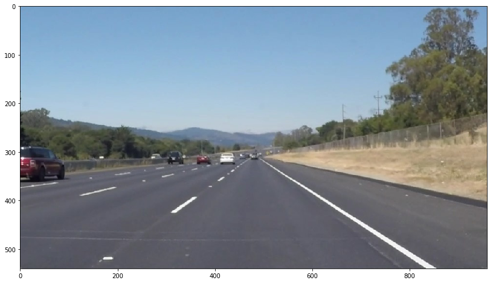

#### Color selection 

Applied filtering to remove colors below threshold.

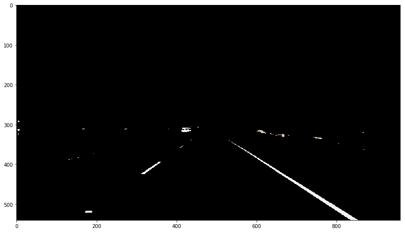

I will keep aside this mask and use it later.

#### Convert the color image in grayscale 

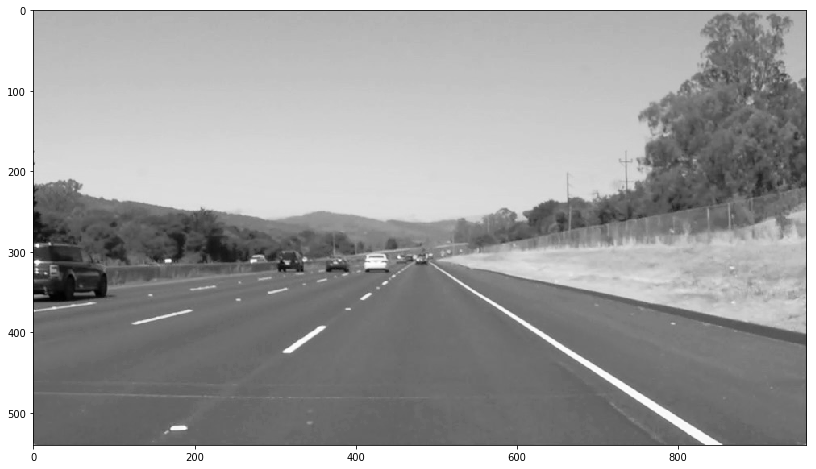

#### Use Canny for edge detection 

Applied gaussian filtering followed by Canny detector. Canny is used to detect edges. Output of Canny 
is not good in some cases so to enhance the results used CV dilate (for enhancement) and then erode (for noise removal)

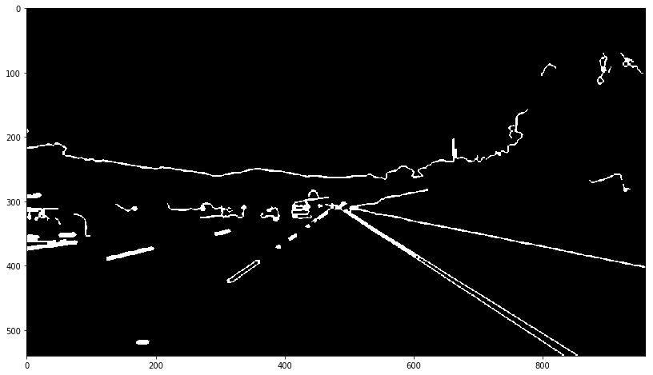

#### Region Of Interest Mask
Two masks: left and right trapezoidal Region Of Interest (ROI) based on the image size. Values were determined using trial and error methid to get best visual representation
 

#### Run Hough transform to detect lines  
  
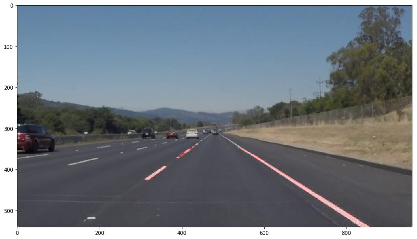

#### Compute lines

To extrapolate results of Hough i.e draw continuous lines, used fitline for both regions of interest. Then drew the lines on original image, like so:  

## Results:

### Pictures
Test image results:   
 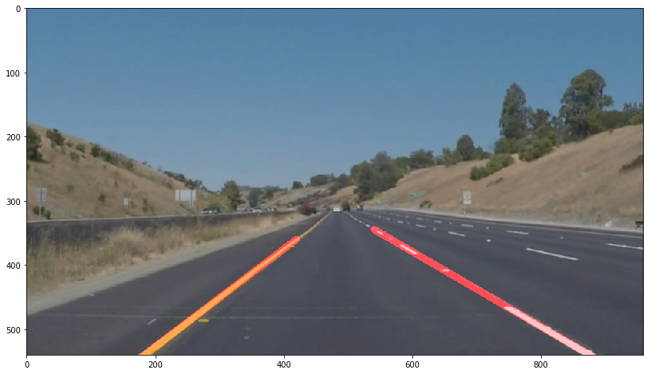    
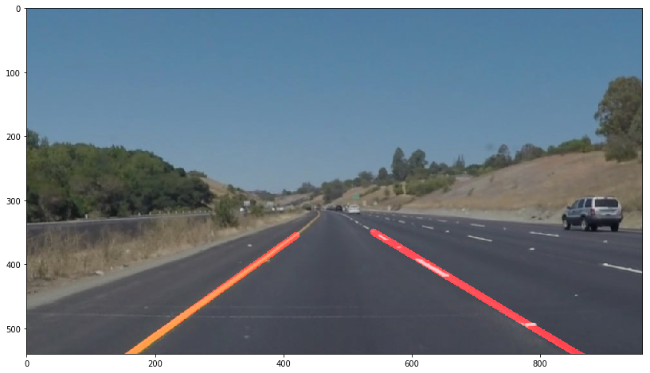 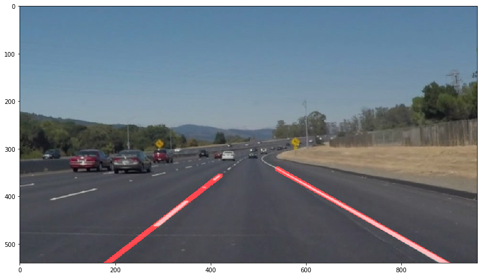   
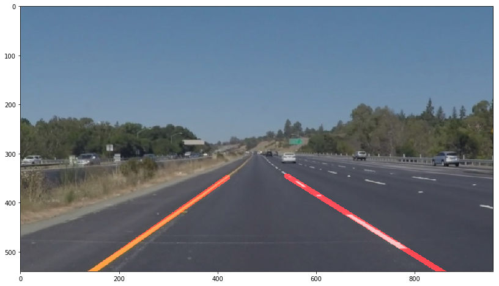     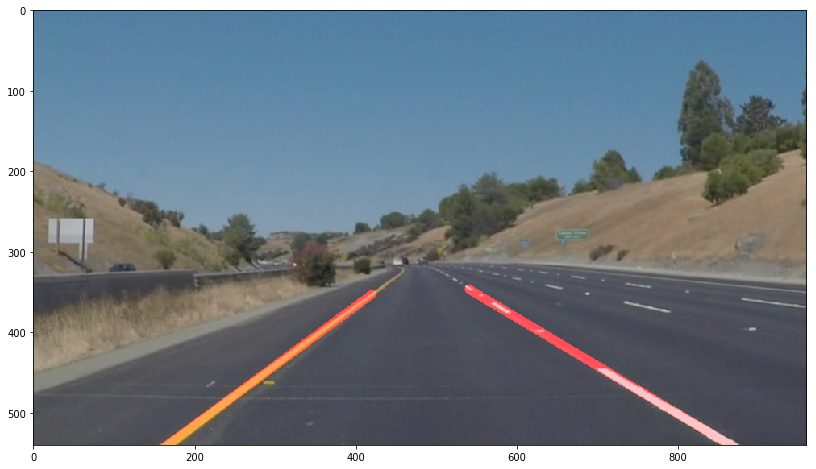        

The original pictures and the results are located in the folder `test_images`.

### Videos
Test videos and results:   

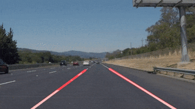 
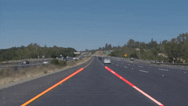
Location of video files: [video1](./yellow.mp4), [video2](./white.mp4).

#### Optional challenge
The challenge video we can identify more difficulties:
* Edge detection difficult using Canny due to decreased gradient variations.
* Curved road
* Lighting issues i.e. shadow darkness 

Tried overcoming the above with a color mask . Result (without the canny detection): 

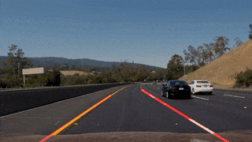  

You can find the video file here: [video_challenge](./extra.mp4)   

The right line is a little jumpy mainly because of the curve: the function `fitline` is trying to fit a line on a curvy lane.

On some analysis, we can see that the Canny detector is not very useful:   

 

while the color mask is better in detecting the lines:   

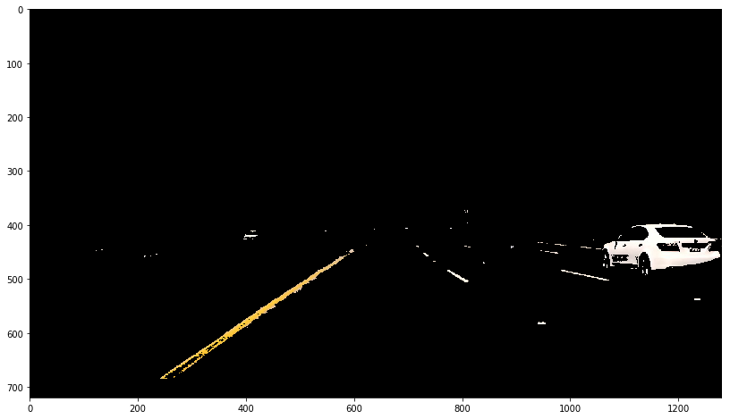
  
Indeed, as you can see in the following picture, we lose valuable color information when we convert the image in grayscale.   

###2. Identify potential shortcomings with your current pipeline

* This approach could not work properly:
    * if there is bumper to bumper traffic
    * if one or more lines are missing
    * inclement weather conditions

###3. Suggest possible improvements to your pipeline

Some possible improvements:

* Probably use the HSV space, instead of the RGB co-ordinate system
* If a edge detection is not possible, use some kind of extrapolation
* Smooth curves using a better filter
